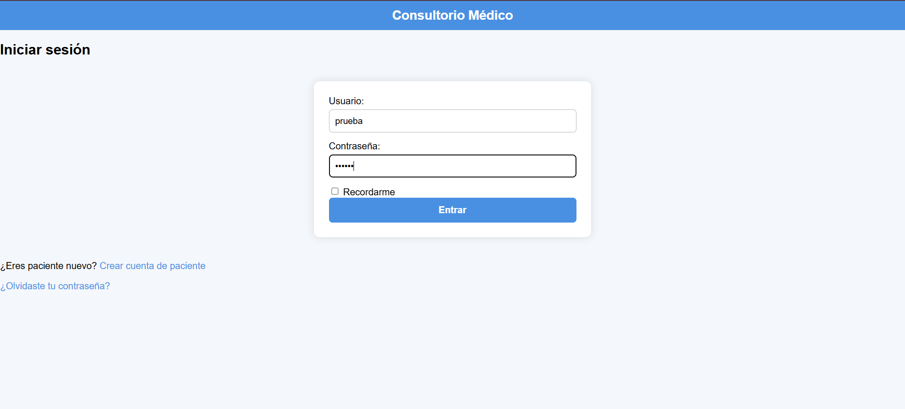
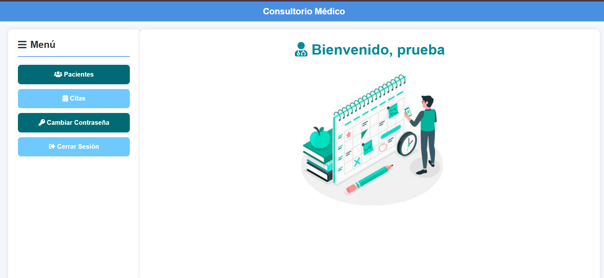
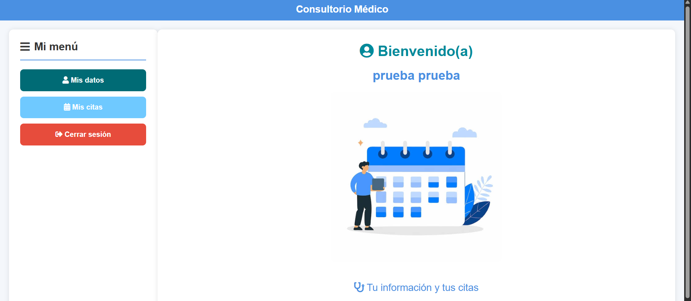
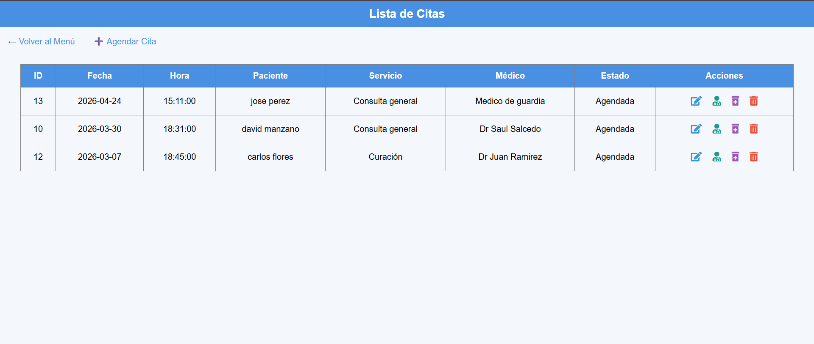
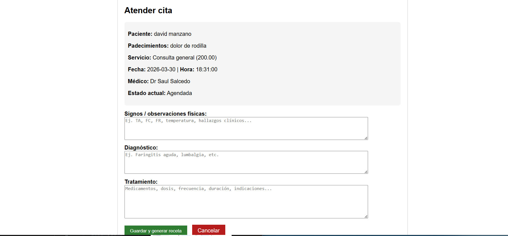
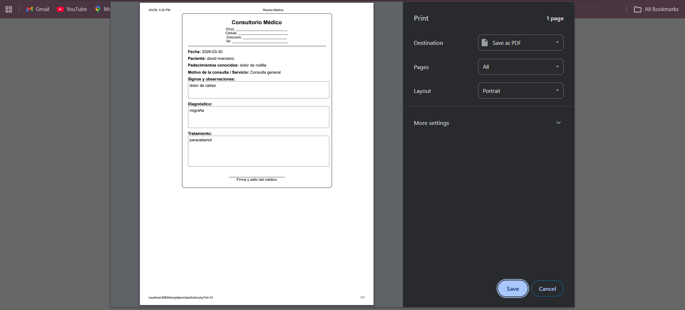

# 🏥 Consultorio Médico — Migración a Arquitectura Hexagonal

[](https://php.net)
[](https://mysql.com)
[](https://getbootstrap.com/)
[](https://www.docker.com/)
[]()

> Sistema de gestión para consultorio médico. Nació como un proyecto escolar con código espagueti
> y fue migrado completamente a Arquitectura Hexagonal (Puertos y Adaptadores) como ejercicio real
> de refactorización y buenas prácticas.

---

## 🧩 Historia del Proyecto

El sistema original era PHP puro sin ninguna estructura: archivos mezclando SQL, lógica de negocio
e HTML en la raíz del proyecto. Sin capas, sin separación de responsabilidades, sin forma de
hacer cambios sin romper todo.

La migración no fue trivial. Hubo un problema de **BOM (Byte Order Mark)** — caracteres invisibles
al inicio de archivos PHP que rompían silenciosamente la ejecución. La solución fue detectarlos,
recrear los archivos desde cero y migrar el código limpio a la nueva estructura.

El resultado es un sistema con capas bien definidas, credenciales 100% por variables de entorno,
Docker para despliegue reproducible y una separación clara entre dominio, aplicación e infraestructura.

> Ver [PRODUCT.md](./PRODUCT.md) para entender las decisiones de producto y arquitectura detrás del proyecto.

---

## ✅ Funcionalidades

- **Autenticación con roles**: Admin/Doctor y Paciente, sesiones seguras
- **Módulo de Pacientes**: CRUD completo con datos clínicos (alergias, padecimientos, signos vitales)
- **Módulo de Citas**: agendar, editar, cambiar estado (Agendada / Atendida / Cancelada)
- **Atención Médica**: registro de signos, diagnóstico y tratamiento por cita
- **Generación de Recetas**: ticket de atención imprimible por cita atendida
- **Portal del Paciente**: ver datos personales, historial de citas y agendar nuevas
- **Docker**: levanta todo con un comando

---

## 🏗️ Tecnologías

| Capa | Tecnología | Razón |
|---|---|---|
| Backend | PHP 8.2 puro (sin frameworks) | Cada decisión es visible y explicable |
| Base de datos | MySQL 8.0 | Ampliamente adoptado, fácil de levantar en Docker |
| Frontend | Bootstrap 5 + SweetAlert2 + FontAwesome | UI funcional sin sobreingeniería |
| Infraestructura | Docker | Despliegue reproducible en cualquier máquina |

---

## 📊 Antes vs Después

| Aspecto | Código Original | Tras la Migración |
|---|---|---|
| **Organización** | Archivos sueltos, SQL mezclado con HTML | Capas definidas: Domain, Application, Infrastructure |
| **Mantenibilidad** | Cualquier cambio afectaba todo | Cambios aislados por capa |
| **Credenciales** | Hardcodeadas en el código fuente | 100% variables de entorno |
| **Acoplamiento** | Todo dependía de todo | Capas independientes vía interfaces |
| **Escalabilidad** | Muy limitada | Agregar módulos sin tocar los existentes |
| **Documentación** | Inexistente | README + PRODUCT.md |

---

## 📁 Estructura del Proyecto

```
consultorio-hexagonal/
├── src/
│   └── Application/
│       └── UseCase/           # Casos de uso: lógica de negocio
│           ├── Cita/          # guardar, actualizar, eliminar cita
│           └── Paciente/      # guardar, actualizar, eliminar paciente
├── templates/                 # Vistas separadas de la lógica
│   ├── auth/                  # login, registro, cambio de clave
│   ├── citas/                 # CRUD de citas + atención + ticket
│   └── pacientes/             # CRUD de pacientes
├── public/                    # Assets públicos (CSS, JS, imágenes, vendor)
├── config/
│   └── config.php             # Configuración global + conexión BD
├── docs/                      # Capturas de pantalla del sistema
├── conexion.php               # Conexión base de datos (usa .env)
├── .env.example               # Plantilla de variables de entorno
├── docker-compose.yml         # Orquestación Docker
├── Dockerfile                 # Imagen PHP 8.2 + Apache
├── PRODUCT.md                 # Decisiones de producto y arquitectura
└── README.md
```

---

## 👥 Roles y Permisos

| Rol | Acceso |
|---|---|
| 👨‍⚕️ **Admin / Doctor** | Gestión total: pacientes, citas, atenciones, recetas |
| 👤 **Paciente** | Ver datos personales, historial de citas, agendar nueva cita |

---

## 📸 Capturas de Pantalla

| Login | Menú Doctor | Lista de Pacientes |
|---|---|---|
|  |  |  |

| Lista de Citas | Atender Cita | Ticket / Receta |
|---|---|---|
|  |  |  |

---

## 🚀 Instalación

### Opción 1: Docker (recomendado)

**Requisitos:** Docker Desktop instalado y corriendo. MySQL corriendo en tu máquina local.

```bash
# 1. Clonar el repositorio
git clone https://github.com/mhdavid405-cell/consultorio-hexagonal.git
cd consultorio-hexagonal

# 2. Configurar variables de entorno
cp .env.example .env
# Edita .env con tus credenciales de MySQL

# 3. Levantar el contenedor
docker-compose up -d

# 4. Abrir en el navegador
http://localhost:8080
```

**Comandos útiles:**
```bash
docker-compose logs -f web   # Ver logs en tiempo real
docker-compose down          # Detener contenedor
docker-compose restart       # Reiniciar
```

### Opción 2: PHP local

```bash
git clone https://github.com/mhdavid405-cell/consultorio-hexagonal.git
cd consultorio-hexagonal
cp .env.example .env
# Edita .env con tus credenciales locales
php -S localhost:8080
```

---

## 👤 Usuarios de Prueba

| Usuario | Contraseña | Rol |
|---|---|---|
| `admin` | `admin123` | Admin / Doctor |
| `pruebaprueba` | `123` | Paciente |

> ⚠️ Solo para entorno local. Cambiar credenciales antes de cualquier despliegue real.

---

## 📄 Licencia

MIT

---

## 👨‍💻 Autor

**Manzano Hernandez David Axel**
📧 mhdavid405@gmail.com
🐙 [github.com/mhdavid405-cell](https://github.com/mhdavid405-cell)

Proyecto escolar migrado de código espagueti a arquitectura hexagonal como ejercicio
real de refactorización, buenas prácticas y pensamiento orientado a producto.

⭐️ Si te fue útil, deja una estrella al repo.
